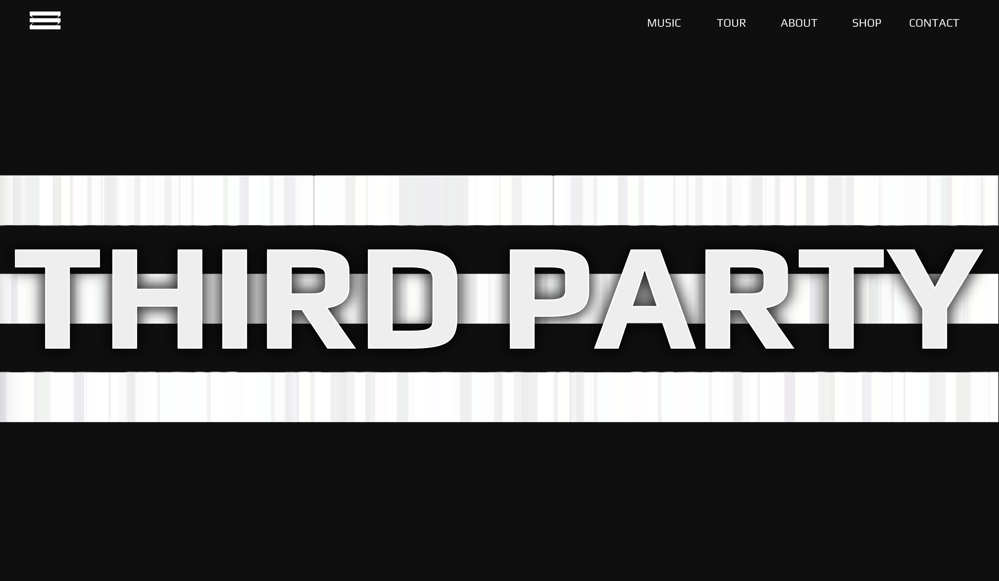

# 🎨 ThirdParty Project

This project is a **Vue 3 + JavaScript + Vite** web application.  
It was created as a **personal project** to practice modern web development with Vue 3.

---

## 🌍 Link

🔗 https://www.djthirdparty.com

---

## 🚀 Tech Stack

- ⚡ **Vue 3 (Composition API + `<script setup>`)**
- 🟨 **JavaScript (ES6+)**
- ⚙️ **Vite**
- 🎨 **SCSS**
- 🌐 **Responsive & Mobile-friendly design**

---

## 📸 Preview



---

## 🛠️ Project Setup

```sh
npm install
```

### Compile and Hot-Reload for Development

```sh
npm run dev
```

### Compile and Minify for Production

```sh
npm run build
```
